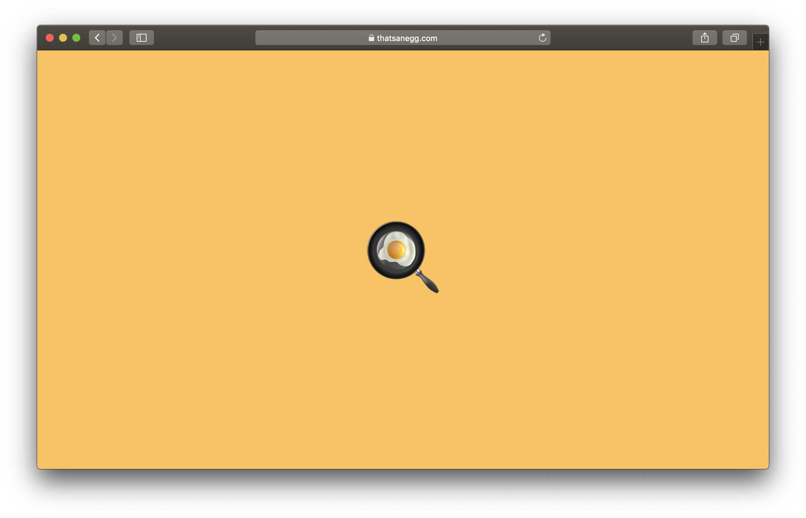

<h1 align="center">
  🍳
  <a href="https://thatsanegg.com">
    That's an Egg!
  </a>
  🍳
</h1>

These days, web-development can be a very daunting task to learn for the developer who's just starting out. With things like JavaScript frameworks, server-side rendering, and REST/CRUD API's, it doesn't get a lot simpler either.

**However, it doesn't have to be this way!** I love writing about making your (developer) life easier. From basic HTML & CSS, to more complicated subjects regarding web-development, I write about all of them.

You might know the expression "That's a piece of cake". In Dutch, we have a saying that goes likewise. Roughly translated back to English, it says **"That's an Egg"**. With my writing, I want to make you feel confident in your ability as a developer and think; "That's an Egg!".
